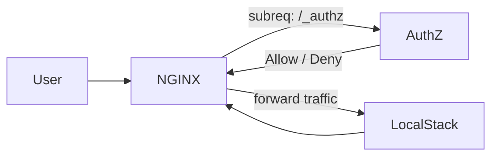

# LocalStack AuthZ

a lightweight security layer for LocalStack that blocks unauthorized requests. It extracts the AccessKeyId from each request and allows only whitelisted keys to pass through.

## Architecture



## Usage

```yml
services:
  localstack: # u have to ensure that localstack is not reachable to the outside network.
    .
    .
    .
    networks:
      - lsnet

  authz:
    image: chxmxi/localstack-authz:latest
    container_name: authz
    depends_on: [localstack]
    environment:
      - ALLOWED_KEYS=dummyaccesskeys,AKIA2L03056B890WYAAZ,LKIAQAAAAAAAN7PNUWLO #add your AKs whitelist
      - AUTHZ_DEBUG=true #enable debug 
    networks: [lsnet]

  proxy:
    build:
      context: ../proxy
    container_name: proxy
    ports:
      - "80:80"
    depends_on:
      - localstack
      - authz
    networks: [lsnet]

networks:
  lsnet:
    driver: bridge
    external: false
```

### Contribute
Feel free to open an issue or a PR if you have any ideas.
