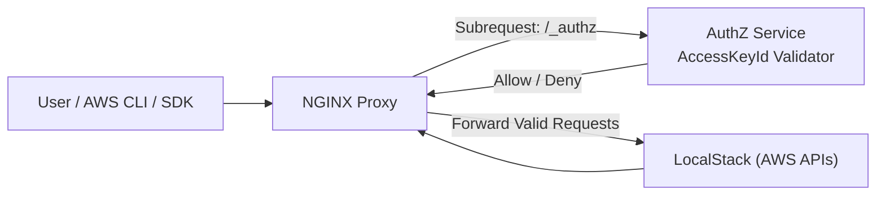

# LocalStack AuthZ

AuthZ is a lightweight security layer to localstack that prevents unauthorized access. It extracts the **AccessKeyId** from the request allowing only whitelisted keys to proceed.

## Architecture

Feel free to open an issue or a PR if you have any ideas.